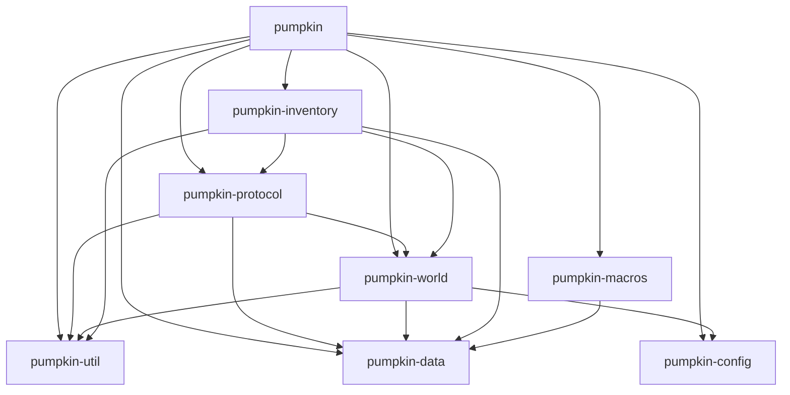

Pumpkin is built using a modular architecture with multiple crates that work together to provide a complete Minecraft server implementation. This document outlines the system architecture and how the different modules interact.

## Workspace Structure

Pumpkin uses a Cargo workspace to organize code into focused, reusable modules:

```toml
[workspace]
members = [
    "pumpkin-api-macros",
    "pumpkin-config",
    "pumpkin-util",
    "pumpkin-inventory",
    "pumpkin-macros/",
    "pumpkin-protocol/",
    "pumpkin-world",
    "pumpkin/",
    "pumpkin-data",
]
```

## Core Modules

### pumpkin (Main Server)

The main server crate that orchestrates all other modules. It contains:

- **Server Management**: Core server initialization and lifecycle management
- **Network Handling**: Player connection and protocol handling
- **Game Logic**: Block interactions, entity management, commands
- **Plugin System**: Dynamic plugin loading via `libloading`

Key directories:
- `block/` - Block behavior implementations
- `entity/` - Entity logic and AI
- `command/` - Command implementations
- `net/` - Network layer
- `world/` - World management layer
- `server/` - Server core

### pumpkin-protocol

Handles all Minecraft protocol operations:

- **Packet Serialization/Deserialization**: Reading and writing Minecraft packets
- **Encryption**: AES/CFB8 encryption for secure connections
- **Compression**: Zlib compression for packet optimization
- **Multi-version Support**: Both Java and Bedrock editions

Features can be enabled selectively:
```toml
[features]
default = ["query"]
serverbound = []
clientbound = []
query = []
```

### pumpkin-world

World and chunk management system:

- **Chunk Loading**: Asynchronous chunk loading from disk
- **Chunk Generation**: Vanilla-compatible world generation
- **Chunk Caching**: In-memory chunk storage with `DashMap`
- **Lighting Engine**: Dynamic lighting calculations
- **Multi-format Support**: Anvil and Linear chunk formats

Key features:
- Efficient chunk I/O with file caching
- Parallel chunk generation
- Chunk saving and autosave functionality
- Entity chunk data management

### pumpkin-data

Generated data and registries:

- **Block States**: All block state definitions
- **Item Registry**: Item IDs and properties
- **Biome Data**: Biome definitions and properties
- **Entity Types**: Entity type registry
- **Dimension Data**: Dimension configurations
- **Game Rules**: Minecraft game rule definitions

Highly modular with feature flags for selective compilation:
```toml
[features]
default = [
    "item", "packet", "translation", "registry",
    "particle", "sound", "recipes", "entity",
    "dimension", "enchantment", "world", ...
]
```

### pumpkin-config

Configuration management:

- **TOML Parsing**: Server configuration in TOML format
- **Validation**: Configuration validation on load
- **Runtime Helpers**: Optional test helpers for config manipulation

### pumpkin-inventory

Inventory and container management:

- **Player Inventories**: Player inventory handling
- **Container GUIs**: Chest, furnace, and other container interfaces
- **Item Stack Operations**: Item manipulation and validation

### pumpkin-util

Shared utilities:

- **Math Types**: Vector2, Vector3, BlockPos, etc.
- **Text Components**: Rich text formatting
- **Crypto Utilities**: Encryption and hashing helpers
- **NBT Helpers**: Named Binary Tag utilities

### pumpkin-macros

Procedural macros for code generation:

- **Derive Macros**: Custom derives for common patterns
- **Block/Tag Helpers**: Compile-time block and tag validation

### pumpkin-api-macros

Macros for the plugin API system (excluded from main workspace for independent versioning).

## Concurrency Architecture

### Tokio + Rayon Pattern

Pumpkin uses a hybrid concurrency model:

<Warning>
**Critical Rule**: All Rayon calls from the Tokio runtime must be non-blocking!
</Warning>

#### Tokio Runtime (Async I/O)

Used for:
- Network I/O (player connections)
- File I/O (chunk loading/saving)
- Timers and scheduled tasks
- Async coordination

Configuration:
```rust
#[tokio::main]
async fn main() {
    // Multi-threaded runtime
    tokio = { features = [
        "rt-multi-thread",
        "net",
        "fs",
        "sync",
        "macros",
        "time",
    ]}
}
```

#### Rayon (CPU-Intensive Tasks)

Used for:
- Parallel chunk generation
- World generation computations
- Data processing

#### Communication Between Runtimes

Use `tokio::sync::mpsc` channels to transfer data between Tokio and Rayon:

```rust
// Example from pumpkin_world::level::Level::fetch_chunks
let (send, mut recv) = mpsc::channel::<LoadedData>(1);

// Rayon computation sends results through channel
let computation = async move {
    // CPU-intensive work happens here
    send.send(result).await
};

// Tokio receives results asynchronously
while let Some(data) = recv.recv().await {
    // Process data on Tokio runtime
}
```

### Synchronization Primitives

- **DashMap**: Concurrent hashmap for chunk storage
- **Arc**: Shared ownership for immutable data
- **AtomicBool/AtomicU64**: Lock-free atomic operations
- **Mutex**: For mutable state that needs exclusive access
- **TaskTracker**: Track and manage async tasks
- **CancellationToken**: Graceful shutdown coordination

## Data Flow

### Player Connection Flow

1. **Connection** → `pumpkin/net` receives TCP connection
2. **Handshake** → `pumpkin-protocol` handles protocol negotiation
3. **Authentication** → Validates player with Mojang API
4. **Join Game** → `pumpkin/server` initializes player state
5. **Chunk Loading** → `pumpkin-world` loads/generates chunks
6. **Game Loop** → `pumpkin` processes player actions

### Chunk Loading Flow

1. **Request** → Player movement triggers chunk load
2. **Cache Check** → Check `loaded_chunks` DashMap
3. **Disk Load** → `pumpkin-world` async loads from disk
4. **Generation** → If not exists, generate with world generator
5. **Lighting** → Calculate lighting for chunk
6. **Send** → `pumpkin-protocol` serializes and sends to client

### Packet Processing Flow

1. **Receive** → TCP stream receives encrypted/compressed data
2. **Decrypt** → `pumpkin-protocol` decrypts if encryption enabled
3. **Decompress** → Decompress if compression enabled
4. **Deserialize** → Parse into packet struct
5. **Handle** → `pumpkin` processes packet logic
6. **Response** → Send response packets back to client

## Performance Considerations

### Compilation Profiles

```toml
[profile.release]
lto = true              # Link-time optimization
strip = "debuginfo"     # Remove debug symbols
codegen-units = 1       # Better optimization

[profile.profiling]
inherits = "release"
debug = true           # Keep debug info for profiling
strip = false
```

### Clippy Configuration

Pumpkin enforces strict linting:
```toml
[workspace.lints.clippy]
all = { level = "deny", priority = -1 }
nursery = { level = "deny", priority = -1 }
pedantic = { level = "deny", priority = -1 }
cargo = { level = "deny", priority = -1 }
```

This ensures code quality and catches potential issues early.

## Module Dependencies



## Next Steps

- [Building from Source](/development/building) - Set up your development environment
- [Contributing Guidelines](/development/contributing) - Learn how to contribute to Pumpkin